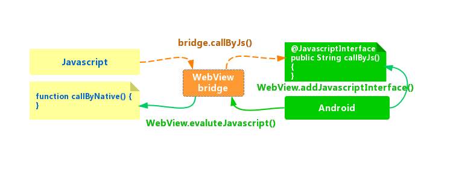
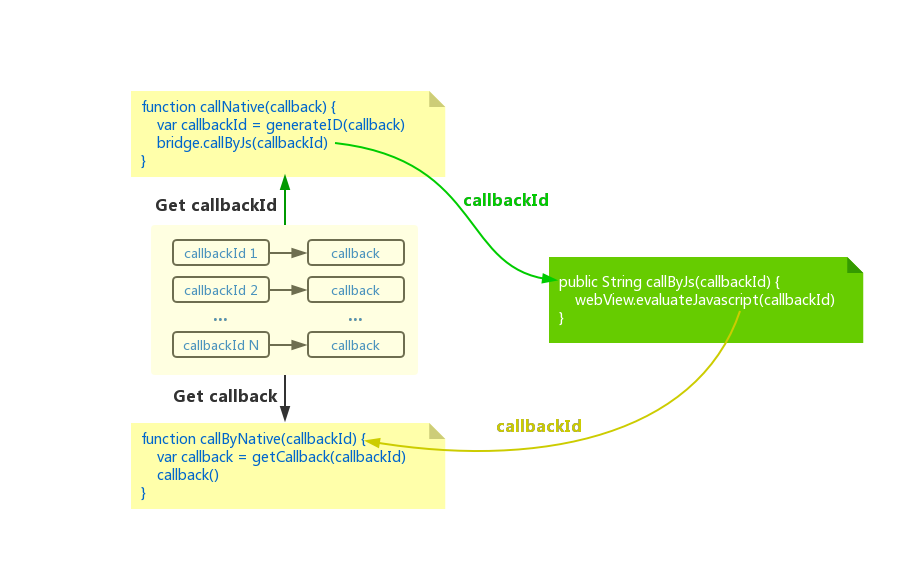

Javascript语言和Native语言(譬如Android的Java)要实现互通，中间需要有一个**翻译**，这个翻译就像一座**桥**，一边搭着Javascript，另一边搭着Native，一桥飞架南北，天堑变通途。
两边跨**桥**通信，需满足**桥**的约束，否则容易引发事故：信息超标，桥不能载；信息频繁，桥会拥塞；信息敏感，桥需屏蔽。由此可见，设计一个优秀的**桥**并非易事。

在实际工程实践中，还需要考虑前端业务开发的便利性，即前端Javascript一套代码，Android和iOS都提供同样的Native能力，这要求**桥**的设计兼顾不同Native端的特性。
本系列文章从基础到进阶，再到升华，全面剖析**桥**的使用和原理。

> 本文是基础篇，解答以下问题：
>
> 1. Javascript如何调用Java？
> 2. Java如何调用Javascript？
> 3. 如何处理调用参数、返回值和异步回调？

## 1) 实现框架

在解答问题之前，先上本例的实现框架，这是一个实现了Javascript和Android双向通信的实例：



**Android**

- `@JavascriptInterface`：定义给Javascript调用的接口**callByJs()**
- `WebView.addJavascriptInterface()`：构建所谓的**桥**，让Javascript可以访问`@JavascriptInterface`定义的接口
- `WebView.evaluateJavascript()`：主动调用Javascript的接口，参数为Javascript字符串，譬如：**"javascript: callByNative()"**

**Javascript**

- 定义给Native调用的接口**callByNative()**
- 通过**桥**调用Native提供的接口**bridge.callByJs()**。此处，bridge可以理解为**桥**的名称，实际编码中可以自行定义

需要说明的是，**桥**的实现方式并不是唯一的，从Javascript调用Java就有如下多种方式：

| 调用方式 | 说明 |
| --- | --- |
| `iframe.src` | 当在Javascript将url赋值给iframe.src时，WebView的`shouldOverrideUrlLoading()`接口将会被调用，利用这条通路就能实现数据通信 |
| `alert​()`, `​confirm​()`, ​`prompt()` | 当在Javascript调用`alert()`, `confirm()`, `prompt()`方法时，WebView都有对应的接口被调用，同样可以实现数据通信 |
| `console.log()` | 与以上数据通路大同小异 |
| `@JavascriptInterface` | Android实现的一种**桥**，通过WebView主动告知Javascript哪些接口可用，本例就是采用的此种方式 |

本例以Android平台作为演示，采用注解`@JavascriptInterface`的实现方式，这个注解是Android 4.2之后引入的，相当于Android显示的限制哪些接口才能被Javascrit调用。
Android 4.2之前的版本会把所有的接口都暴露给Javascript，这样是存在安全隐患的。

市面上流行的产品，更多的是采用`iframe.src`的方式，这种方式通常被称为`URL拦截`，Android通过实现`shouldOverrideUrlLoading()`对URL进行拦截，从而达到解析URL参数的目的。

在Android上，Java调用Javascript的方式也有多种：

| 调用方式 | 说明 |
| --- | --- |
| WebView.loadUrl() | Android API 19之前的用法，不能获取Javascript执行后的返回值 |
| WebView.evaluateJavascript() | Android API 19之后的推荐用法，能够获取Javascript执行后的返回值 |

以上几种方式的优劣和内部原理在进阶篇中会有介绍。


## 2) 问题解答

### 2.1) Javascript调用Java

HTML中定义输入框和发送按钮：

```html
<input type="text" class="form-control" id="inputMessage" placeholder="Enter message to android">
<button id="sendButton" class="btn btn-primary">Send to android</button>
```

Javascript中定义按钮的点击事件，一旦触发，就将输入框的文本发送到Native：

```javascript
var sendButton = document.getElementById("sendButton")
sendButton.addEventListener("click", () => {
    var res = bridge.send(inputMessage.value)
    console.debug(res)
})
```

其中，**bridge**就是我们所说的**桥**，它是由Native命名，并绑定在窗口对象(window)上。Native还向**bridge**注册了供Javascript调用的`send()`接口。

### 2.2) Java调用Javascript

Javascript中定义供Java调用的接口，注意：该接口可以定义返回值的，返回值可以被Java获取。

```javascript
// Javascript endpoint called by native
function onReceived(data) {
    var receivedMessage = document.getElementById("receivedMessage");
    receivedMessage.innerHTML = data
    return "I am web, responding message to you"
}
```

Java中构造一个字符串，其内容就是满足Javascript语法的一个函数调用，通过`WebView.evaluateJavascript()`就能完成从Java到Javascript的调用，
Javascript函数执行完后的返回值，会作为ValueCallback对象再次返回给Java。

```java
// Java call javascript
String script="javascript: onReceived("Hello, message from native")";
mWebView.evaluateJavascript(script, new ValueCallback<String>() {
    @Override
    public void onReceiveValue(String value) {
        // Handle returned value from javascript
        info(value);
    }
});
```

### 2.3) 如何处理调用参数、返回值和异步回调？

**参数和返回值**

Javascript和Java之间只支持基本的数据类型(int, bool, string等)，高级的对象类型都需要结果序列化和反序列化才能传递和解析，
好在两端都有强大的**JSON**工具，因此，采用**JSON**定义参数和返回值的数据格式成为首选。

Javascript调用Java的返回值直接可以获取；Java调用Javascript的返回值，可以通过`WebView.evaluateJavascript()`的回调参数获取，
复杂一点的数据类型都可以定义为string，在一端序列化成字符串传输，在另一端反序列化成对象即可。

**异步回调**

处理Javascript调用Java的异步回调，会稍微麻烦一点，最常见的做法是将回调函数映射成一个唯一标记后传给Java：



- 当Javascript调用Java时，将回调函数映射成唯一的callbackId
- 在Javascript中构建一个映射表，保存callbackId到回调函数callback的映射

```javascript
var callbackMap = {}

// Javascricpt call native asynchronously via bridge
function sendAsync(data, callback) {

    var callbackId = ''
    if (typeof callback === 'function') {
        // Generate an uuid for callback
        callbackId = 'callback_' + generateUUID();
        callbackMap[callbackId] = callback;
    }

    bridge.sendAsync(data, callbackId)
}
```

- 在Javascript中提供一个给Native调用的接口(callByNative)，接收callbackId作为参数
- 当Java收到调用请求后，根据具体时机调用Javascript的callByNative接口，并将callbackId作为参数

```javascript
// Javascript endpoint call by native
function onAsyncCallback(callbackId, result) {
    if (callbackId && callbackMap[callbackId]) {
        var callback = callbackMap[callbackId]
        callback(result)
        delete callbackId[callbackId]
    }

    return "I am web, responding async callback to you"
}
```

## 3) 小结

通过本例，读者可以了解到Android平台上，如何来实现Javascript和Java的相互调用。

网上有很多JsBridge的库，它们都是加强版的**桥**，其封装的内核还是本文所述的WebView提供的基础能力：

- **easilycoder/EasyBridge**: <https://github.com/easilycoder/EasyBridge>
- **wendux/DSBridge**: <https://github.com/wendux/DSBridge-Android>, <https://github.com/wendux/DSBridge-IOS>
- **lzysd/JsBridge**: <https://github.com/lzyzsd/JsBridge>
- **marcuswestin/WebViewJavascriptBridge**: <https://github.com/marcuswestin/WebViewJavascriptBridge>
